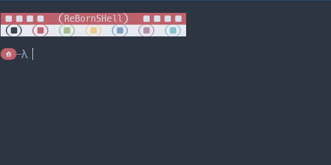

[](https://deepsource.io/gh/DeBeast591/RebornShell/?ref=repository-badge)
[](https://deepsource.io/gh/DeBeast591/RebornShell/?ref=repository-badge)
[](https://www.codefactor.io/repository/github/debeast591/rebornshell/overview/master) [](https://gitter.im/RebornShell/community?utm_source=badge&utm_medium=badge&utm_campaign=pr-badge&utm_content=badge)

# RBSH - ReBorn SHell
This is an attempt at making a complete shell for Linux that is fast, tiny in size, and powerful

And by tiny, I mean as of [this commit](https://github.com/DeBeast591/RebornShell/commit/87af93d6e0babaaaa33d17176003de0676defea2), it's **179** lines SLOC! (Excluding the Example/ folder and the README)

And as of [this commit](https://github.com/DeBeast591/RebornShell/commit/74099b76a478dbdaab527aeb30785865884a7396) it's only **220** lines SLOC. (Again excluding Example/* and the README) For how much it's grown since the commit in the line above this, it seems to be growing (In terms of function and SLOC) at a pretty nice rate!


# Installing
Installing is probably one of the most simple things!

Here's a one-liner to do it all for you:

```SH
git clone https://github.com/DeBeast591/RebornShell && mv RebornShell ~/.config/
```

Wherever your shell is defined, and replace it with:
```SH
python3 /home/<Your Username>/.config/RebornShell/rbsh.py
```

And that's it!

If it fails, make an issue on the issue tracker so you can get help or it can be fixed.


# ~~Doing my work for me~~ Contributing
Just make a PR or an issue.


# Config
The config file for this is just a Python file at the moment, and I've made sure that just about everything in RBSH is configurable.

There are also plenty of comments that should help you at least a little bit when making the configuration

I recommend you take a look at `rbsh_colors.py` as well, that way you know about the `Color` class and the preset colors.

If you have a Nerd Font, then you can use those characters as well. (If supported by your terminal.)


# Examples
My personal config:




If you've made a config that you want here, please show me!
